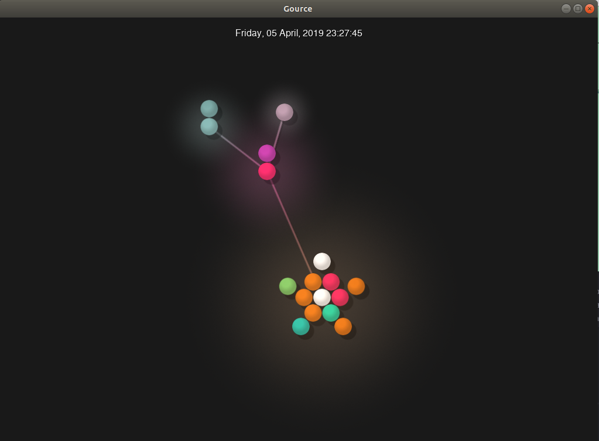

# Lab 3

Evan Lazaro

## Documentation

### Project

As of now, I am still interested in pursuing a project in Web Development. However I am realizing that although basically all the open source projects I have seen / worked on at RPI have been web projects, other types of projects do exist.

While browsing through a list of "Awesome for beginners" repos on GitHub, I noticed Mattermost was on the list. This might be interesting since we are using it for this course, plus it is written in Go, a language I am interested in learning.

I will likely end up choosing a Web project, so I am looking to use technologies like Go, Flask, Django, and/or Postgres since these are used in projects for the Web Technologies Group which I am a part of.

### Latex

   

## Community

### Repo Information

https://github.com/AutomaticDoorControl/AutomaticDoorControl

**Number of contributors**: 3  
**Number of lines of code**: 1068

**The first commit**: "Initial commit" on Jan 26, 2018  (0d579f8012bdfa949d89500c11a9454ac87f4c11)  
**The latest commit**: "Added Sample Door Data" on April 5, 2019 (cc3b6e9b5373ea4e828ad21be22a9bed023370de)  
**The current branches**: Just one - Master

### Gitstats

The numbers between gitstats and the information found on github and using git ls-files are slightly different for lines of code and number of authors. I surmise that the discrepancy for lines of code may be due to the repo containing PDF and other strange file types which are counted differently.

This tool provides some really interesting visualizations for commits and timelines, I definitely plan to use it to explore repos in the future!

### Gource

While my video was pretty unexciting since there were not many commits/files, watching the gource for the person sitting next to me whose repo had over 1800 commits was really interesting to see - cool program!

### Group Member Repos

Sam - https://github.com/apexal/late    
**Number of contributors**: 13    
**Number of lines of code**: 38850    
**The first commit**: September 7, 2018   
**The latest commit**: June 7, 2019    
**Branches**: 11   

Priya - https://github.com/OpenCircuits/OpenCircuits 
**Number of contributors**: 16    
**Number of lines of code**: 15335    
**The first commit**: "first commit" initialized repo with empty README on March 22, 2017 
**The latest commit**: "update README.md" to change some links 19 hours ago 
**Branches**: 11  

Thomas - https://github.com/Hubert51/AutoGrading 
**Number of contributors**: 12  
**Number of lines of code**: 761878  
**The first commit**: "Initial commit" on Sep 15, 2017  
**The latest commit**: "rename the folder name and add more data into data base to train the.." on January 16th   
**Branches**: 1 
