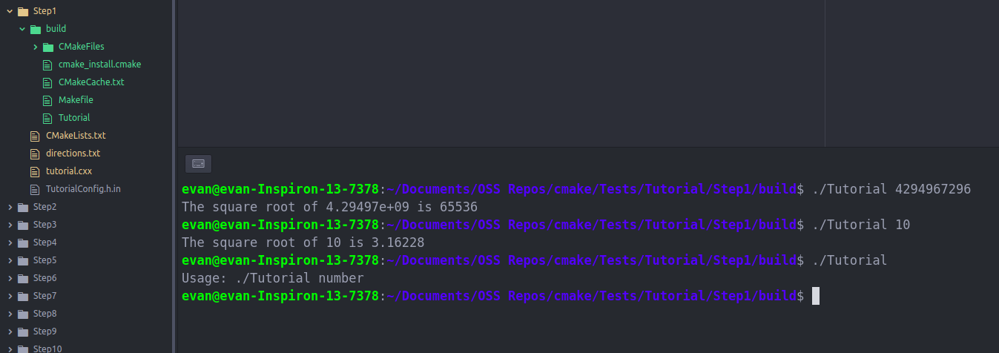
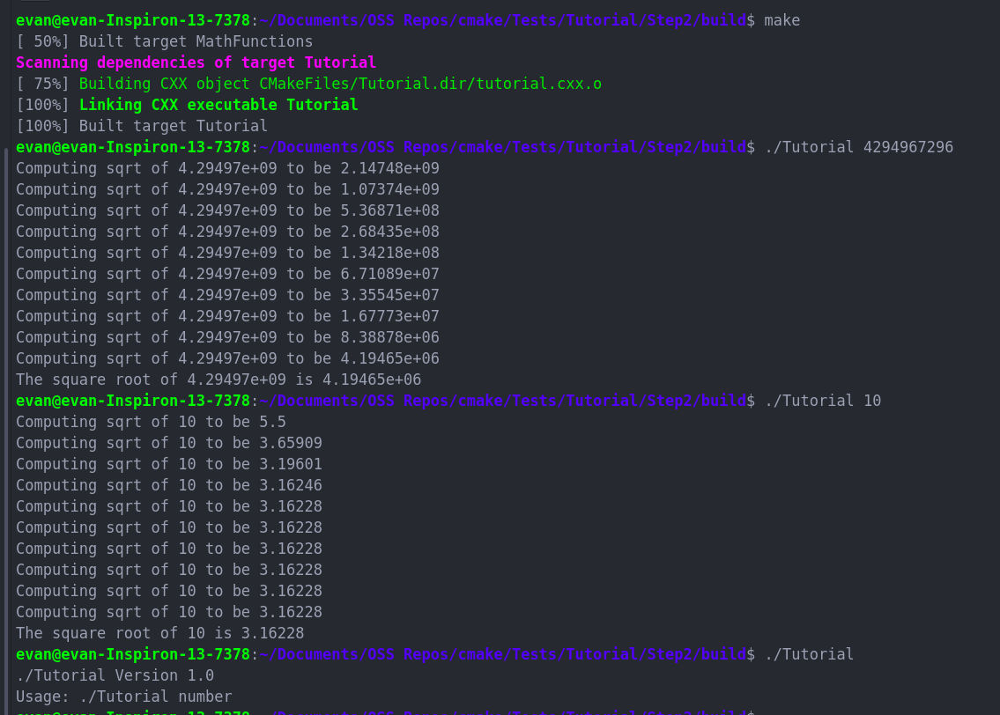
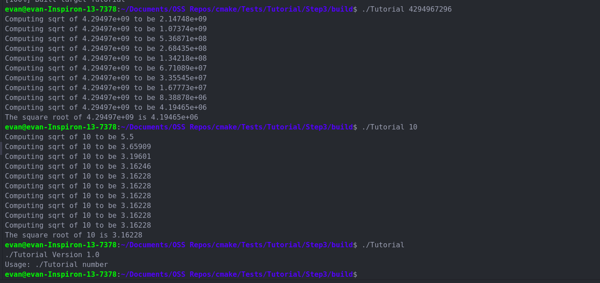
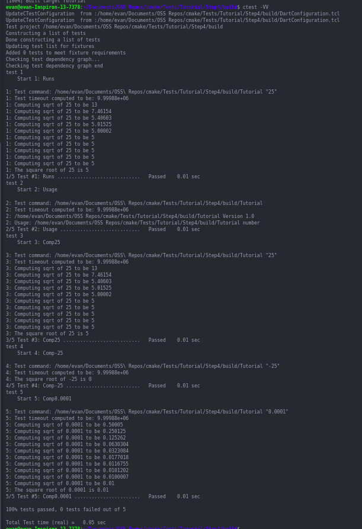
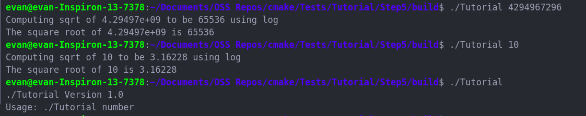
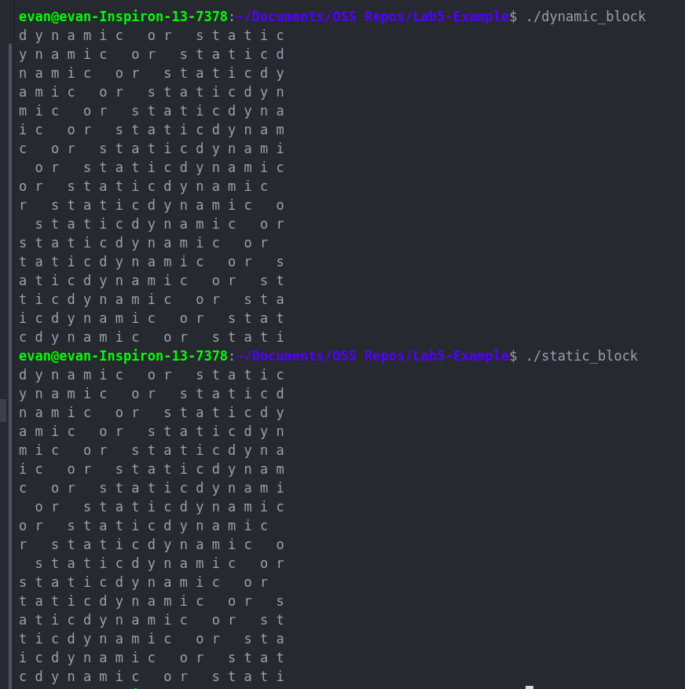

# Lab 5

Evan Lazaro

## Cmake Tutorial

### Step 1

Files:  
[CMakeLists.txt](Step1/CMakeLists.txt) 
[tutorial.cxx](Step1/tutorial.cxx)

### Step 2

Files:  
[CMakeLists.txt](Step2/CMakeLists.txt)  
[tutorial.cxx](Step2/tutorial.cxx)

### Step 3

Files:  
[CMakeLists.txt](Step3/CMakeLists.txt)  
[MathCMakeLists.txt](Step3/MathCMakeLists.txt)  

### Step 4

Files:  
[CMakeLists.txt](Step4/CMakeLists.txt)  
[MathCMakeLists.txt](Step4/MathCMakeLists.txt)  

### Step 5

Files:  
[CMakeLists.txt](Step5/CMakeLists.txt)  
[MathCMakeLists.txt](Step5/MathCMakeLists.txt)  

## Lab Example

Files:  
[Manual Makefile](MakePractice/Makefile)  
[CMake Makefile](MakePractice/Cmake_Makefile)  
[CMakeLists.txt](MakePractice/CMakeLists.txt)  

dynamic_block is 8296 bytes and static_block is 8464 bytes
