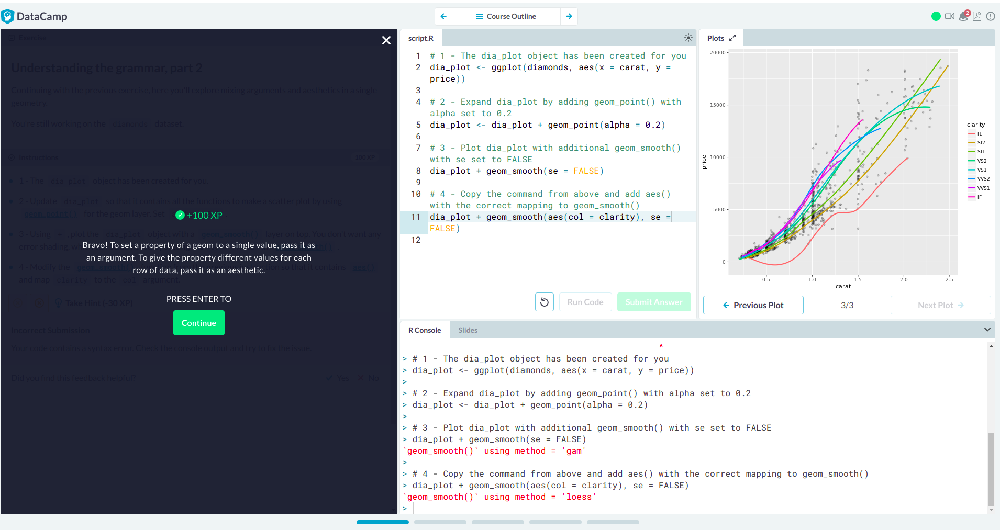
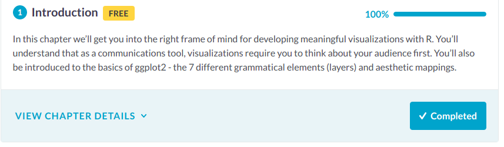
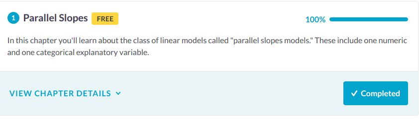

## Lab 8

Evan Lazaro

### Data Visualization with ggplot2

  

  

  

  

  

  

  

### Multiple and Logistic Regression

  

  

  

  

### Observatory Page

https://rcos.io/projects/wtg/shuttletracker/profile
